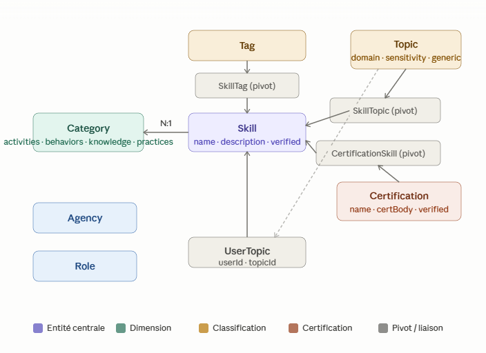
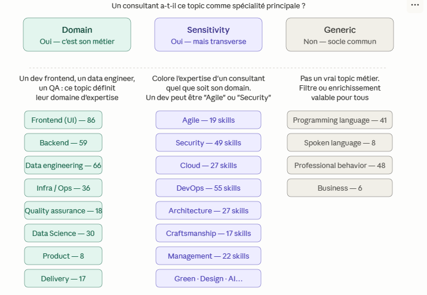
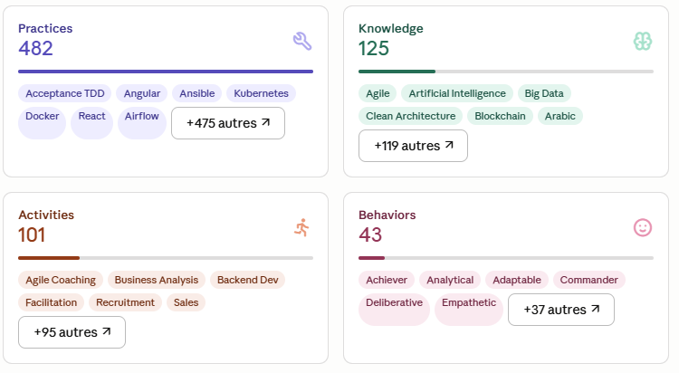
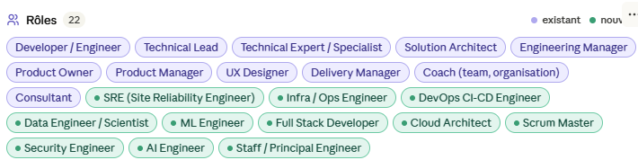
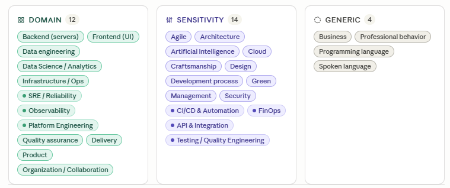

# SillZ Data model

## The tables schema

.

## The relationship between some entities

.


## Some data

.

## Evolutions proposed

### New Data model

.

.


### Cleanings ROLE

1. Split du role Devops

```SQL
INSERT INTO "public"."Role" ("name") VALUES
('SRE (Site Reliability Engineer)'),
('Infra / Ops Engineer'),
('DevOps CI-CD Engineer')
 ON CONFLICT ("name") DO NOTHING;
 ```

2. Ajout de role manquant

```SQL
 INSERT INTO "public"."Role" ("name") VALUES
('Data Engineer / Scientist'),
('Scrum Master'),
('Security Engineer')
 ON CONFLICT ("name") DO NOTHING;
 ```

### CLEANING TOPICS

```SQL
INSERT INTO "public"."Topic" ("type", "name") VALUES
('domain',       'SRE / Reliability'),
('sensitivity',  'CI/CD & Automation'),
('sensitivity',  'FinOps')
 ON CONFLICT ("name") DO UPDATE SET "type" = EXCLUDED."type";
```

REcuperation des infos de DevOps

```SQL
INSERT INTO "public"."SkillTopic" ("skillId", "topicId")
  SELECT skill.id, topic.id
  FROM "public"."Topic" topic
  JOIN "public"."Skill" skill ON topic.name = 'SRE / Reliability'
  WHERE skill.name IN (
     Pratiques SRE core
    'Site Reliability Engineering',
    'Service levels management: SLA, SLI, SLO',
    'Chaos Engineering',
    'Chaos Monkey',
    'Metrics policy',
     Observabilité & monitoring
    'Metrology',
    'Monitoring',
    'Prometheus',
    'Thanos',
    'Grafana',
    'Datadog',
    'Dynatrace',
    'Elastic Observability'
  )
  ON CONFLICT DO NOTHING;
  ```

3. Rattachement des skills → CI/CD & Automation
    Skills issus de DevOps + Development process

```SQL
INSERT INTO "public"."SkillTopic" ("skillId", "topicId")
  SELECT skill.id, topic.id
  FROM "public"."Topic" topic
  JOIN "public"."Skill" skill ON topic.name = 'CI/CD & Automation'
  WHERE skill.name IN (
     Concepts
    'Continuous Integration',
    'Continuous Deployment',
    'CI CD',
    'GitOps',
    'DevSecOps',
    'Accelerate',
     Outils CI
    'Gitlab CI',
    'Github Actions',
    'Jenkins',
    'Bamboo',
    'CircleCI',
    'Drone CI',
     GitOps / CD
    'ArgoCD',
    'FluxCD',
    'Kustomize',
    'Helm',
     Conteneurs (lien fort avec CI/CD)
    'Docker',
    'Docker Compose',
    'Containerization'
  )
  ON CONFLICT DO NOTHING;
```

4. Rattachement des skills → FinOps

```SQL
INSERT INTO "public"."SkillTopic" ("skillId", "topicId")
  SELECT skill.id, topic.id
  FROM "public"."Topic" topic
  JOIN "public"."Skill" skill ON topic.name = 'FinOps'
  WHERE skill.name IN (
    'AWS FinOps',
    'Kubernetes FinOps'
  )
  ON CONFLICT DO NOTHING;
```

### gestion des categories vide

1. Topic : Design
  Logique : tout skill dont l'objet principal est de
    concevoir des interfaces, des expériences ou des visuels.
    NB : les skills restent aussi dans Frontend (UI) si déjà
    liés — ON CONFLICT DO NOTHING gère les doublons.

```SQL
INSERT INTO "public"."SkillTopic" ("skillId", "topicId")
  SELECT skill.id, topic.id
  FROM "public"."Topic" topic
  JOIN "public"."Skill" skill ON topic.name = 'Design'
  WHERE skill.name IN (
     Disciplines design
    'Design',
    'UI Design',
    'UX Design',
    'UX Research',
    'UX Writing',
    'Graphic Design',
    'Motion Design',
    'Game Design',
    'Product Design',
     Méthodes
    'Design Thinking',
    'Design System',
    'Atomic UX research',
    'Discovery (UX)',
    'Design Management',
    'Design Sprint',
    'Accessibility',
     Outils
    'Figma',
    'Adobe XD',
    'Sketch',
    'Framer',
    'Axure',
    'InVision',
    'Marvel app',
    'Zeplin',
    'Zeroheight',
    'Storybook',
    'Ant Design'
  )
  ON CONFLICT DO NOTHING;
```

 2. Topic : Artificial Intelligence
    Logique : skills couvrant l'IA, le ML, le Deep Learning,
    les LLMs et les pratiques associées (MLOps, Prompt…).
    Les outils cloud (SageMaker, Vertex AI) restent aussi
    dans Cloud et Data Science / Analytics.

```SQL
INSERT INTO "public"."SkillTopic" ("skillId", "topicId")
  SELECT skill.id, topic.id
  FROM "public"."Topic" topic
  JOIN "public"."Skill" skill ON topic.name = 'Artificial Intelligence'
  WHERE skill.name IN (
     Concepts fondamentaux
    'Artificial Intelligence',
    'Machine Learning',
    'Generative Artificial Intelligence',
    'Large Language Model (LLM)',
    'Generative Pre-trained Transformers (GPT)',
    'Prompt Engineering',
    'Retrieval Augmented Generation (RAG)',
    'Natural Language Processing',
    'Computer Vision',
    'Classification (ML)',
    'Regression (ML)',
    'Recommendation Systems (ML)',
    'Data Science',
     Pratiques & ops
    'MLOps',
    'MLflow',
    'Kubeflow',
     Frameworks & librairies
    'TensorFlow',
    'pyTorch',
    'Keras',
    'Scikit-Learn',
     Outils cloud IA
    'AWS SageMaker',
    'GCP Vertex AI',
    'Azure Machine Learning',
    'DialogFlow',
    'Chatbot',
     IA générale
    'IA',
    'Koalas'
  )
  ON CONFLICT DO NOTHING;
```

3. Topic : Organization / Collaboration
   Logique : skills portant sur le travail collectif,
   la transformation organisationnelle, les outils de
   collaboration et les pratiques d'équipe.
   Distinct de Management (qui couvre le pilotage/gestion)
   et d'Agile (qui couvre les frameworks de delivery).

```SQL
INSERT INTO "public"."SkillTopic" ("skillId", "topicId")
  SELECT skill.id, topic.id
  FROM "public"."Topic" topic
  JOIN "public"."Skill" skill ON topic.name = 'Organization / Collaboration'
  WHERE skill.name IN (
     Transformation & structure
    'Organization transformation',
    'Change Management',
    'IT Change Management',
    'Team Topologies',
    'System Thinking',
     Pratiques d équipe
    'Team Management',
    'Agile Ceremonies Facilitation',
    'Facilitation',
    'Graphic facilitation',
    'Liberating Structures',
    'Non Violent Communication',
    'Host Leadership',
    'Management 3.0',
     Comportements collectifs
    'Team-first',
     Outils de collaboration
    'Miro',
    'Mural',
    'Klaxoon',
    'Confluence'
  )
  ON CONFLICT DO NOTHING;
```

### Normaliser la casse /TAG

 Phase 2 : Normalisation des tags en doublon de casse + suppression des tags invalides (typos)

 Stratégie : on garde la variante minuscule (ou la plus utilisée),
 on migre les SkillTag vers le tag canonique, puis on supprime les doublons.

 ANALYSE préalable (depuis les seeds) :
   tag         | variante gardée | variante supprimée | skillTags à migrer
   |-||-
   agile       | 'agile'    (25) | 'AGILE'        (0) | aucune
   backend     | 'backend'  (52) | 'Backend'      (0) | aucune
   ci/cd       | 'ci/cd'     (0) | 'CI/CD'        (0) | aucune
   javascript  | 'javascript'(0) | 'JAVASCRIPT'   (0) | aucune
   language    | 'language' (56) | 'Language'     (0) | aucune
   mobile      | 'mobile'    (6) | 'Mobile'       (0) | aucune
   python      | 'python'    (6) | 'Python'       (1) | 1 à migrer (skill Python)
   script      | 'script'    (0) | ' script'      (0) | aucune
   ,fgg        | — suppression pure                   | aucune


#### ÉTAPE 1A : tag 'agile'
   Skills liés à l'agilité sans ce tag

```SQL
INSERT INTO public."SkillTag"
  SELECT skill.id, tag.id FROM public."Tag" tag
  JOIN public."Skill" skill ON tag.name = 'agile'
  WHERE skill.name IN (
    'Agile Ceremonies Facilitation',
    'SAFe Release Train Engineer (RTE)',
    'ExPD'
  )
  ON CONFLICT DO NOTHING;
```

#### ÉTAPE 1B : tag 'backend'
   Skills backend sans ce tag

```SQL
INSERT INTO public."SkillTag"
  SELECT skill.id, tag.id FROM public."Tag" tag
  JOIN public."Skill" skill ON tag.name = 'backend'
  WHERE skill.name IN (
    'Apache HTTP Server',
    'API Gateway',
    'API Management',
    'Django',
    'FastAPI',
    'gRPC',
    'PowerAPI',
    'Serverless',
    'Spring AI'
  )
  ON CONFLICT DO NOTHING;
```

#### ÉTAPE 1C : tag 'ci/cd'   Tous les outils CI/CD sans ce tag

``` SQL
INSERT INTO public."SkillTag"
  SELECT skill.id, tag.id FROM public."Tag" tag
  JOIN public."Skill" skill ON tag.name = 'ci/cd'
  WHERE skill.name IN (
    'ArgoCD',
    'Bamboo',
    'CircleCI',
    'Continuous Deployment',
    'Continuous Integration',
    'CI CD',
    'Drone CI',
    'FluxCD',
    'Github Actions',
    'GitLab',
    'Gitlab CI',
    'Jenkins'
  )
  ON CONFLICT DO NOTHING;
```

#### ÉTAPE 1D : tag 'javascript'
   Frameworks et libs JS sans ce tag

```SQL
INSERT INTO public."SkillTag"
  SELECT skill.id, tag.id FROM public."Tag" tag
  JOIN public."Skill" skill ON tag.name = 'javascript'
  WHERE skill.name IN (
    'AdonisJS',
    'Angular',
    'AngularJS',
    'BackboneJS',
    'D3.js',
    'ElectronJS',
    'Electron',
    'ElysiaJS',
    'EmberJS',
    'ExpressJS',
    'GatsbyJS',
    'Jest',
    'Koa.js',
    'LeafletJS',
    'NestJS',
    'NextJS',
    'NuxtJS',
    'Playwright',
    'Protractor',
    'React Native',
    'ReactJS',
    'Redux',
    'RxJS',
    'SolidJS',
    'SvelteJS',
    'Tanstack React Query',
    'Typescript',
    'Vue.js',
    'Webpack',
    'Javascript'
  )
  ON CONFLICT DO NOTHING;
```

#### ÉTAPE 1E : tag 'mobile'
   Skills mobile sans ce tag

```SQL
INSERT INTO public."SkillTag"
  SELECT skill.id, tag.id FROM public."Tag" tag
  JOIN public."Skill" skill ON tag.name = 'mobile'
  WHERE skill.name IN (
    'Android Studio',
    'Ionic',
    'Kotlin',
    'Mobile Development',
    'Mobile Efficiency Index',
    'RxSwift',
    'Swift',
    'SwiftUI'
  )
  ON CONFLICT DO NOTHING;
```
#### ÉTAPE 1F : tag 'python'
   Skills Python sans ce tag

```SQL
INSERT INTO public."SkillTag"
  SELECT skill.id, tag.id FROM public."Tag" tag
  JOIN public."Skill" skill ON tag.name = 'python'
  WHERE skill.name IN (
    'Airflow',
    'Django',
    'FastAPI',
    'Poetry (Python)',
    'TensorFlow'
  )
  ON CONFLICT DO NOTHING;
```

#### ÉTAPE 1G : tag 'script'
   Scripts et outils de scripting sans ce tag

```SQL
INSERT INTO public."SkillTag"
  SELECT skill.id, tag.id FROM public."Tag" tag
  JOIN public."Skill" skill ON tag.name = 'script'
  WHERE skill.name IN (
    'Ansible',
    'Ansible Molecule',
    'Bash',
    'Groovy',
    'Shell',
    'Terraform',
    'Typescript'
  )
  ON CONFLICT DO NOTHING;
```


#### ÉTAPE 1BIS : migration du seul SkillTag à risque
   skill 'Python' utilise le tag 'Python' (majuscule)
   → le faire pointer vers 'python' (minuscule) avant suppression


```SQL
UPDATE "public"."SkillTag"
  SET "tagId" = (SELECT id FROM "public"."Tag" WHERE name = 'python')
  WHERE "tagId" = (SELECT id FROM "public"."Tag" WHERE name = 'Python')
    AND "skillId" = (SELECT id FROM "public"."Skill" WHERE name = 'Python');
```


#### ÉTAPE 2 : suppression des variantes en doublon
   Toutes sans SkillTag après l'étape 1 — suppression directe

```SQL
DELETE FROM "public"."Tag" WHERE name IN (
  'AGILE',        doublon de 'agile'
  'Backend',      doublon de 'backend'
  'CI/CD',        doublon de 'ci/cd'
  'JAVASCRIPT',   doublon de 'javascript'
  'Language',     doublon de 'language'
  'Mobile',       doublon de 'mobile'
  'Python'        doublon de 'python' (migré à l étape 1)
);
```


#### ÉTAPE 3 : suppression des tags invalides (typos)
   Aucun SkillTag associé — suppression directe

```SQL
DELETE FROM "public"."Tag" WHERE name IN (
  ',fgg',     typo évidente
  ' script'   espace en préfixe, doublon de 'script'
);
```
#### VÉRIFICATION post-migration (à exécuter manuellement)

```SQL
 SELECT name, COUNT(*) FROM "public"."Tag"
   GROUP BY LOWER(name)
   HAVING COUNT(*) > 1;
 → doit retourner 0 lignes

 SELECT t.name, COUNT(st."skillId") as nb_skills
   FROM "public"."Tag" t
   LEFT JOIN "public"."SkillTag" st ON st."tagId" = t.id
   WHERE t.name IN ('python','agile','backend','language','mobile','ci/cd','javascript','script')
   GROUP BY t.name
   ORDER BY t.name;
 → python doit avoir 7 skills (6 + 1 migré), les autres inchangés
```

### Skill mal classées

Phase 2 : Recatégorisation des skills mal classés

9 corrections identifiées, regroupées en 3 blocs :
  A. behaviors  → practices  (1 skill)
  B. knowledge  → practices  (3 skills)
  C. practices  → knowledge  (4 skills)
  D. activities → knowledge  (1 skill)

Logique de catégorisation appliquée :
  practices  = outil ou méthode qu'on FAIT / qu'on UTILISE en mission
  knowledge  = concept, discipline ou modèle qu'on SAIT / qu'on CONNAÎT
  activities = mission facturable qu'on RÉALISE pour un client
  behaviors  = trait de personnalité (CliftonStrengths uniquement)

#### BLOC A : behaviors → practices

UX Writing : compétence rédactionnelle métier, pas un trait de personnalité

``` SQL
UPDATE "public"."Skill"
  SET "categoryId" = '89780de3-4a4c-40c2-bcdf-b5d15a48437a'
  WHERE name = 'UX Writing'
    AND "categoryId" = '89f5e9a5-5ce6-416c-bed9-dd736546aa7f';
```

#### BLOC B : knowledge → practices


Configuration Management DataBase (CMDB) : outil concret (ServiceNow, iTop…)


``` SQL
UPDATE "public"."Skill"
  SET "categoryId" = '89780de3-4a4c-40c2-bcdf-b5d15a48437a'
  WHERE name = 'Configuration Management DataBase (CMDB)'
    AND "categoryId" = 'c3341edb-3c1f-4e3d-bf89-8e795eb13690'
```

AWS FinOps : pratique outillée AWS, cohérent avec 'Kubernetes FinOps' déjà en practices

``` SQL
UPDATE "public"."Skill"
  SET "categoryId" = '89780de3-4a4c-40c2-bcdf-b5d15a48437a'
    WHERE name = 'AWS FinOps'
    AND "categoryId" = 'c3341edb-3c1f-4e3d-bf89-8e795eb13690';
```

Secrets management : pratique d'exploitation (Vault, AWS Secrets Manager…)

``` SQL
UPDATE "public"."Skill"
  SET "categoryId" = '89780de3-4a4c-40c2-bcdf-b5d15a48437a'
  WHERE name = 'Secrets management'
    AND "categoryId" = 'c3341edb-3c1f-4e3d-bf89-8e795eb13690';
```
#### BLOC C : practices → knowledge (discutable)


BAH model : modèle conceptuel (Booz Allen Hamilton), pas un outil
``` SQL
UPDATE "public"."Skill"
  SET "categoryId" = 'c3341edb-3c1f-4e3d-bf89-8e795eb13690'
  WHERE name = 'BAH model'
    AND "categoryId" = '89780de3-4a4c-40c2-bcdf-b5d15a48437a';
```

C4 Model : modèle de documentation d'architecture, pas un outil

``` SQL
UPDATE "public"."Skill"
  SET "categoryId" = 'c3341edb-3c1f-4e3d-bf89-8e795eb13690'
    WHERE name = 'C4 Model'
    AND "categoryId" = '89780de3-4a4c-40c2-bcdf-b5d15a48437a';
```


Radical Product Thinking : philosophie produit, pas une pratique outillée
``` SQL
UPDATE "public"."Skill"
  SET "categoryId" = 'c3341edb-3c1f-4e3d-bf89-8e795eb13690'
    WHERE name = 'Radical Product Thinking'
    AND "categoryId" = '89780de3-4a4c-40c2-bcdf-b5d15a48437a';
```

Scorecard-Markov model : modèle mathématique/analytique, pas un outil

``` SQL
UPDATE "public"."Skill"
  SET "categoryId" = 'c3341edb-3c1f-4e3d-bf89-8e795eb13690'
    WHERE name = 'Scorecard-Markov model'
    AND "categoryId" = '89780de3-4a4c-40c2-bcdf-b5d15a48437a';
```
#### BLOC D : activities → knowledge


Social Engineering : technique d'attaque/sensibilisation sécurité,
pas une mission facturable à part entière

``` SQL
UPDATE "public"."Skill"
  SET "categoryId" = 'c3341edb-3c1f-4e3d-bf89-8e795eb13690'
    WHERE name = 'Social Engineering'
    AND "categoryId" = '06420261-3e78-4a91-bc6a-1a52cad5d6a1';
```


#### VÉRIFICATION post-migration

``` SQL
SELECT s.name, c.label as categorie
  FROM "public"."Skill" s
  JOIN "public"."Category" c ON c.id = s."categoryId"
  WHERE s.name IN (
    'UX Writing',
    'Configuration Management DataBase (CMDB)',
    'AWS FinOps',
    'Secrets management',
    'BAH model',
    'C4 Model',
    'Radical Product Thinking',
    'Scorecard-Markov model',
    'Social Engineering'
  )
  ORDER BY c.label, s.name;
--
Résultat attendu :
  knowledge  : BAH model, C4 Model, Radical Product Thinking,
               Scorecard-Markov model, Social Engineering
  practices  : AWS FinOps, Configuration Management DataBase (CMDB),
               Secrets management, UX Writing

```


### doublons de skill


### Migrer les skills devops vers les nouveaux topics

 Les 55 skills DevOps sont répartis en 4 destinations :
   SRE / Reliability    →  9 skills (observabilité, fiabilité, incidents)
   CI/CD & Automation   → 16 skills (pipelines, livraison continue, GitOps)
   Infrastructure / Ops → 25 skills (IaC, containers, K8s, PaaS)
   DevOps (conserver)   →  5 skills (transverses — lien DevOps maintenu)

 PRÉREQUIS : le fichier 11-topics-devops-split.sql doit avoir été exécuté
             (les topics SRE/Reliability et CI/CD & Automation doivent exister)

 ORDRE D'EXÉCUTION :
   1. Ajouter les nouveaux liens SkillTopic (INSERT)
   2. Supprimer les anciens liens vers DevOps (DELETE)
   3. Vérifier, puis supprimer le topic DevOps si vide (optionnel)

#### ÉTAPE 1A : Nouveaux liens → SRE / Reliability

```SQL
INSERT INTO "public"."SkillTopic" ("skillId", "topicId")
  SELECT skill.id, topic.id
  FROM "public"."Topic" topic
  JOIN "public"."Skill" skill ON topic.name = 'SRE / Reliability'
  WHERE skill.name IN (
    'Site Reliability Engineering',
    'Chaos Engineering',
    'Chaos Monkey',
    'Metrics policy',
    'Metrology',
    'Prometheus',
    'Thanos',
    'Elastic Observability',
    'Fluent Bit'
  )
  ON CONFLICT DO NOTHING;
 ```


#### ÉTAPE 1B : Nouveaux liens → CI/CD & Automation

```SQL
INSERT INTO "public"."SkillTopic" ("skillId", "topicId")
  SELECT skill.id, topic.id
  FROM "public"."Topic" topic
  JOIN "public"."Skill" skill ON topic.name = 'CI/CD & Automation'
  WHERE skill.name IN (
    'CI CD',
    'Continuous Integration',
    'Continuous Deployment',
    'Gitlab CI',
    'Github Actions',
    'Jenkins',
    'Bamboo',
    'CircleCI',
    'Drone CI',
    'ArgoCD',
    'FluxCD',
    'GitOps',
    'Kustomize',
    'Helm',
    'Ansible Molecule',
    'DevSecOps'
  )
  ON CONFLICT DO NOTHING;
```SQL


#### ÉTAPE 1C : Nouveaux liens → Infrastructure / Ops
  (topic existant — on ajoute les skills qui n'y étaient que via DevOps)

```SQL
INSERT INTO "public"."SkillTopic" ("skillId", "topicId")
  SELECT skill.id, topic.id
  FROM "public"."Topic" topic
  JOIN "public"."Skill" skill ON topic.name = 'Infrastructure / Ops'
  WHERE skill.name IN (
    Kubernetes & dérivés
    'Kubernetes',
    'Kubespray',
    'k3s',
    'Openshift',
    'Rancher',
    Containers
    'Docker',
    'Docker Compose',
    'Docker Swarm',
    'Docker Desktop',
    'Containerization',
    Réseau & routing
    'Traefik',
    Backup & disaster recovery
    'Velero',
    ML Infra
    'Kubeflow',
    FinOps K8s
    'Kubernetes FinOps',
    IaC & config management
    'Ansible',
    'Chef',
    'Puppet',
    'SaltStack',
    'Terraform',
    'Infrastructure As Code',
    Cloud K8s managés
    'AWS EKS',
    'Azure Kubernetes Service',
    'GKE',
    PaaS
    'Heroku'
  )
  ON CONFLICT DO NOTHING;
 ```


#### ÉTAPE 2 : Suppression des liens vers DevOps
  Uniquement pour les skills migrés vers d autres topics.
  Les 5 skills "transverses" conservent leur lien DevOps.

```SQL
DELETE FROM "public"."SkillTopic"
  WHERE "topicId" = (
    SELECT id FROM "public"."Topic" WHERE name = 'DevOps'
  )
  AND "skillId" IN (
    SELECT id FROM "public"."Skill" WHERE name IN (
      Migré vers SRE / Reliability
      'Site Reliability Engineering',
      'Chaos Engineering',
      'Chaos Monkey',
      'Metrics policy',
      'Metrology',
      'Prometheus',
      'Thanos',
      'Elastic Observability',
      'Fluent Bit',
      Migré vers CI/CD & Automation
      'CI CD',
      'Continuous Integration',
      'Continuous Deployment',
      'Gitlab CI',
      'Github Actions',
      'Jenkins',
      'Bamboo',
      'CircleCI',
      'Drone CI',
      'ArgoCD',
      'FluxCD',
      'GitOps',
      'Kustomize',
      'Helm',
      'Ansible Molecule',
      'DevSecOps',
      Migré vers Infrastructure / Ops
      'Kubernetes',
      'Kubespray',
      'k3s',
      'Openshift',
      'Rancher',
      'Docker',
      'Docker Compose',
      'Docker Swarm',
      'Docker Desktop',
      'Containerization',
      'Traefik',
      'Velero',
      'Kubeflow',
      'Kubernetes FinOps',
      'Ansible',
      'Chef',
      'Puppet',
      'SaltStack',
      'Terraform',
      'Infrastructure As Code',
      'AWS EKS',
      'Azure Kubernetes Service',
      'GKE',
      'Heroku'
    )
  );
 ```


#### ÉTAPE 3 (optionnelle) : Supprimer le topic DevOps
  À exécuter seulement après validation que les 5 skills
  restants (DevOps, DevOps Coaching, DataOps, MLOps,
  Accelerate) sont bien couverts par d autres topics.


```SQL
 Vérifier d abord :
   SELECT s.name, array_agg(t.name) as topics
     FROM "public"."Skill" s
     JOIN "public"."SkillTopic" st ON st."skillId" = s.id
     JOIN "public"."Topic" t ON t.id = st."topicId"
     WHERE s.name IN ('DevOps','DevOps Coaching','DataOps','MLOps','Accelerate')
     GROUP BY s.name;
--
Si chaque skill a au moins un autre topic → supprimer DevOps :
--
  DELETE FROM "public"."SkillTopic"
    WHERE "topicId" = (SELECT id FROM "public"."Topic" WHERE name = 'DevOps');
--
  DELETE FROM "public"."UserTopic"
    WHERE "topicId" = (SELECT id FROM "public"."Topic" WHERE name = 'DevOps');
--
  DELETE FROM "public"."Topic" WHERE name = 'DevOps';
```

 VÉRIFICATION post-migration

```SQL

1. Compter les skills restants dans DevOps (doit être 5) :
    SELECT COUNT(*) FROM "public"."SkillTopic" st
      JOIN "public"."Topic" t ON t.id = st."topicId"
      WHERE t.name = 'DevOps';
--
2. Vérifier la répartition dans les nouveaux topics :
    SELECT t.name as topic, COUNT(*) as nb_skills
      FROM "public"."Topic" t
      JOIN "public"."SkillTopic" st ON st."topicId" = t.id
      WHERE t.name IN (
        'SRE / Reliability',
        'CI/CD & Automation',
        'Infrastructure / Ops',
        'DevOps'
      )
      GROUP BY t.name
      ORDER BY nb_skills DESC;
--
Résultat attendu :
  Infrastructure / Ops  ~59  (25 ajoutés + 36 existants)
  CI/CD & Automation     16
  SRE / Reliability       9  (+ Datadog, Grafana, Monitoring ajoutés en phase 1)
  DevOps                  5  (transverses conservés)
 ```


### Descriptions manquantes

- Phase 1/2 : Descriptions des 20 skills practices les plus connus
--
Format : UPDATE ciblé par nom, idempotent.
Langue : anglais (cohérent avec les noms de skills existants)
Longueur : 1-2 phrases, max ~30 mots — lisible dans une UI card

#### Containers & Orchestration

```` SQL
UPDATE "public"."Skill" SET "description" =
  'Container runtime for packaging applications and their dependencies into portable, isolated environments. Used to build, ship, and run services consistently across dev and production.'
  WHERE name = 'Docker' AND ("description" IS NULL OR "description" = '');

UPDATE "public"."Skill" SET "description" =
  'Open-source container orchestration platform for automating deployment, scaling, and management of containerised workloads. Industry standard for running microservices at scale.'
  WHERE name = 'Kubernetes' AND ("description" IS NULL OR "description" = '');

UPDATE "public"."Skill" SET "description" =
  'Container registry and artifact management server for storing Docker images, npm packages, and other build artifacts. Central hub in CI/CD pipelines.'
  WHERE name = 'ArgoCD' AND ("description" IS NULL OR "description" = '');
````

#### Infrastructure as Code

```` SQL
UPDATE "public"."Skill" SET "description" =
  'Infrastructure as Code tool for provisioning and managing cloud resources declaratively across AWS, GCP, Azure and more. Enables reproducible, version-controlled infrastructure.'
  WHERE name = 'Terraform' AND ("description" IS NULL OR "description" = '');

UPDATE "public"."Skill" SET "description" =
  'IT automation tool for configuration management, application deployment, and orchestration using human-readable YAML playbooks. Agentless and widely adopted in DevOps pipelines.'
  WHERE name = 'Ansible' AND ("description" IS NULL OR "description" = '');
````

#### Frontend

```` SQL
UPDATE "public"."Skill" SET "description" =
  'JavaScript library for building component-based user interfaces. Widely used for single-page applications thanks to its virtual DOM, rich ecosystem, and strong community.'
  WHERE name = 'ReactJS' AND ("description" IS NULL OR "description" = '');

UPDATE "public"."Skill" SET "description" =
  'Progressive JavaScript framework for building user interfaces, known for its gentle learning curve, reactivity system, and single-file component architecture.'
  WHERE name = 'Vue.js' AND ("description" IS NULL OR "description" = '');

UPDATE "public"."Skill" SET "description" =
  'Statically typed superset of JavaScript that adds optional type annotations, improving code quality and developer experience in large-scale applications.'
  WHERE name = 'Typescript' AND ("description" IS NULL OR "description" = '');
````

#### Backend & Runtimes

```` SQL
UPDATE "public"."Skill" SET "description" =
  'General-purpose, high-level programming language valued for its readability and versatility. Dominant in data science, scripting, automation, and backend development.'
  WHERE name = 'Python' AND ("description" IS NULL OR "description" = '');

UPDATE "public"."Skill" SET "description" =
  'Opinionated Java framework that simplifies Spring application setup with auto-configuration and embedded servers. The standard for building production-ready Java microservices.'
  WHERE name = 'Spring Boot' AND ("description" IS NULL OR "description" = '');

UPDATE "public"."Skill" SET "description" =
  'JavaScript runtime built on Chrome''s V8 engine for building fast, scalable server-side applications. Enables full-stack JavaScript development and real-time APIs.'
  WHERE name = 'Node.js' AND ("description" IS NULL OR "description" = '');

UPDATE "public"."Skill" SET "description" =
  'Query language and runtime for APIs that gives clients precise control over the data they request. Replaces multiple REST endpoints with a single, flexible endpoint.'
  WHERE name = 'GraphQL' AND ("description" IS NULL OR "description" = '');
 ```` SQL

#### CI/CD

```` SQL
UPDATE "public"."Skill" SET "description" =
  'Open-source automation server for building, testing, and deploying software through configurable pipelines. The most widely deployed CI/CD tool in enterprise environments.'
  WHERE name = 'Jenkins' AND ("description" IS NULL OR "description" = '');

UPDATE "public"."Skill" SET "description" =
  'GitLab''s built-in CI/CD system defined as code in .gitlab-ci.yml files. Enables automated build, test, and deployment pipelines tightly integrated with source control.'
  WHERE name = 'Gitlab CI' AND ("description" IS NULL OR "description" = '');

UPDATE "public"."Skill" SET "description" =
  'GitHub''s native CI/CD automation platform triggered by repository events. Workflows defined in YAML enable seamless integration of build, test, and deployment pipelines.'
  WHERE name = 'Github Actions' AND ("description" IS NULL OR "description" = '');
````

#### Data & Messaging

```` SQL
UPDATE "public"."Skill" SET "description" =
  'Distributed event streaming platform for high-throughput, fault-tolerant messaging between services. The de facto standard for real-time data pipelines and event-driven architectures.'
  WHERE name = 'Kafka' AND ("description" IS NULL OR "description" = '');

UPDATE "public"."Skill" SET "description" =
  'Powerful open-source relational database known for its reliability, rich feature set, and SQL compliance. Widely used for transactional applications and complex data workloads.'
  WHERE name = 'PostgreSQL' AND ("description" IS NULL OR "description" = '');

UPDATE "public"."Skill" SET "description" =
  'In-memory data store used as a cache, message broker, or database. Enables sub-millisecond response times for session management, leaderboards, and real-time features.'
  WHERE name = 'Redis' AND ("description" IS NULL OR "description" = '');

UPDATE "public"."Skill" SET "description" =
  'Distributed search and analytics engine based on Lucene. Used for full-text search, log analysis, and real-time observability at scale as part of the Elastic Stack.'
  WHERE name = 'Elasticsearch' AND ("description" IS NULL OR "description" = '');
````
#### Observability

```` SQL
UPDATE "public"."Skill" SET "description" =
  'Open-source monitoring and alerting toolkit that collects time-series metrics via a pull model. The standard for infrastructure and application monitoring in cloud-native environments.'
  WHERE name = 'Prometheus' AND ("description" IS NULL OR "description" = '');
````

#### VÉRIFICATION

```` SQL

--
SELECT name, LEFT("description", 80) as desc_preview
  FROM "public"."Skill"
  WHERE name IN (
    'Docker','Kubernetes','Terraform','ReactJS','Typescript',
    'Python','Spring Boot','GraphQL','Ansible','Jenkins',
    'Gitlab CI','Github Actions','Kafka','PostgreSQL','Redis',
    'Elasticsearch','Vue.js','Node.js','Prometheus','ArgoCD'
  )
  ORDER BY name;
→ 20 lignes, aucune description vide
 ````


 ### Aller on rajoute l'observabilité

``` SQL
1. Créer le topic Observability
INSERT INTO "public"."Topic" ("type", "name")
VALUES ('domain', 'Observability')
ON CONFLICT ("name") DO NOTHING;


-- 2. Rattacher les skills d'observabilité au nouveau topic
INSERT INTO "public"."SkillTopic" ("skillId", "topicId")
  SELECT skill.id, topic.id
  FROM "public"."Topic" topic
  JOIN "public"."Skill" skill ON topic.name = 'Observability'
  WHERE skill.name IN (
    'Datadog',
    'Prometheus',
    'Thanos',
    'Grafana',
    'Dynatrace',
    'Elastic Observability',
    'Fluent Bit',
    'Metrology',
    'Monitoring'
  )
  ON CONFLICT DO NOTHING;


-- 3. Retirer ces skills de SRE / Reliability
--    (garder Site Reliability Engineering, Chaos Engineering,
--     Chaos Monkey, Metrics policy, Service levels management)
DELETE FROM "public"."SkillTopic"
  WHERE "topicId" = (
    SELECT id FROM "public"."Topic" WHERE name = 'SRE / Reliability'
  )
  AND "skillId" IN (
    SELECT id FROM "public"."Skill" WHERE name IN (
      'Datadog', 'Prometheus', 'Thanos', 'Grafana',
      'Dynatrace', 'Elastic Observability', 'Fluent Bit',
      'Metrology', 'Monitoring'
    )
  );
```

### Aller les derniers trucs manquants

```SQL
-- Nouveaux rôles
INSERT INTO "public"."Role" ("name") VALUES
('ML Engineer'),
('Cloud Architect'),
('Full Stack Developer'),
('AI Engineer'),
('Staff / Principal Engineer')
ON CONFLICT ("name") DO NOTHING;

-- Nouveaux topics
INSERT INTO "public"."Topic" ("type", "name") VALUES
('domain',      'Platform Engineering'),
('sensitivity', 'API & Integration'),
('sensitivity', 'Testing / Quality Engineering')
ON CONFLICT ("name") DO UPDATE SET "type" = EXCLUDED."type";


sql-- =========================================================
-- Rattachement skills → Platform Engineering
-- =========================================================
INSERT INTO "public"."SkillTopic" ("skillId", "topicId")
  SELECT skill.id, topic.id
  FROM "public"."Topic" topic
  JOIN "public"."Skill" skill ON topic.name = 'Platform Engineering'
  WHERE skill.name IN (
    'Platform Engineering',
    'Backstage',
    'Team Topologies'
  )
  ON CONFLICT DO NOTHING;


-- =========================================================
-- Rattachement skills → Observability
-- =========================================================
INSERT INTO "public"."SkillTopic" ("skillId", "topicId")
  SELECT skill.id, topic.id
  FROM "public"."Topic" topic
  JOIN "public"."Skill" skill ON topic.name = 'Observability'
  WHERE skill.name IN (
    'Datadog',
    'Dynatrace',
    'Elastic Observability',
    'Elastic Stack',
    'ELK',
    'Fluent Bit',
    'Grafana',
    'Metrology',
    'Monitoring',
    'Prometheus',
    'Thanos'
  )
  ON CONFLICT DO NOTHING;


-- =========================================================
-- Rattachement skills → API & Integration
-- NB : OAuth2, SAML, OpenID restent aussi dans Security
--      Kafka, RabbitMQ restent aussi dans Backend et Data
-- =========================================================
INSERT INTO "public"."SkillTopic" ("skillId", "topicId")
  SELECT skill.id, topic.id
  FROM "public"."Topic" topic
  JOIN "public"."Skill" skill ON topic.name = 'API & Integration'
  WHERE skill.name IN (
    -- Patterns & standards
    'API Management',
    'REST',
    'GraphQL',
    'gRPC',
    'Service Mesh',
    'Swagger',
    -- Gateways & ESB
    'API Gateway',
    'MuleSoft',
    'Camel',
    'IBM MQ',
    'Istio',
    'Linkerd',
    -- Messaging
    'Kafka',
    'Kafka Streams',
    'RabbitMQ',
    -- Auth / Identity (standards d intégration)
    'OAuth2',
    'OpenID Connect',
    'SAML'
  )
  ON CONFLICT DO NOTHING;


-- =========================================================
-- Rattachement skills → Testing / Quality Engineering
-- NB : Jest, Cypress, Nightwatch restent aussi dans Frontend
--      Test Driven Development reste aussi dans Craftsmanship
-- =========================================================
INSERT INTO "public"."SkillTopic" ("skillId", "topicId")
  SELECT skill.id, topic.id
  FROM "public"."Topic" topic
  JOIN "public"."Skill" skill ON topic.name = 'Testing / Quality Engineering'
  WHERE skill.name IN (
    -- Frameworks de test
    'JUnit',
    'Jest',
    'Kotest',
    'Spock',
    'StriKT',
    'Vitest',
    'Testing Library',
    -- Mocks & assertions
    'Mockito',
    'MockK',
    'AssertJ',
    -- BDD / ATDD
    'Cucumber',
    'Acceptance Test Driven Development',
    'Behavior Driven Development',
    'Test Driven Development',
    -- E2E & performance
    'Cypress',
    'Playwright',
    'Nightwatch',
    'Gatling',
    'Jmeter',
    'QuickPerf',
    -- Qualité statique
    'Sonar',
    'ecoCode SonarQube Plugin',
    'EcoSonar',
    -- Containers de test
    'Testcontainers',
    -- Activités
    'Software Testing',
    'Data Testing',
    'Usability testing'
  )
  ON CONFLICT DO NOTHING;
```

### ET enfin, rajoutons l'IA

``` SQL
-- Phase 1 : Ajout des 18 skills IA/LLM manquants pour 2025
--
-- Category IDs :
--   knowledge  = 'c3341edb-3c1f-4e3d-bf89-8e795eb13690'
--   practices  = '89780de3-4a4c-40c2-bcdf-b5d15a48437a'
--   activities = '06420261-3e78-4a91-bc6a-1a52cad5d6a1'

-- =========================================================
-- ÉTAPE 1 : Création des skills
-- =========================================================

INSERT INTO "public"."Skill" ("name", "categoryId", "verified", "description") VALUES

-- Agents & orchestration
('AI Agents',
 'c3341edb-3c1f-4e3d-bf89-8e795eb13690', true,
 'Autonomous AI systems that plan, reason and use tools to complete complex tasks. Foundation of agentic workflows combining LLMs, memory and external actions.'),

('LangGraph',
 '89780de3-4a4c-40c2-bcdf-b5d15a48437a', true,
 'Framework for building stateful, multi-actor LLM applications using graph-based workflows. Enables complex agent orchestration with cycles and conditional branching.'),

('CrewAI',
 '89780de3-4a4c-40c2-bcdf-b5d15a48437a', true,
 'Python framework for orchestrating collaborative multi-agent systems where specialized agents work together to complete tasks.'),

('Model Context Protocol (MCP)',
 '89780de3-4a4c-40c2-bcdf-b5d15a48437a', true,
 'Open standard by Anthropic for connecting LLMs to external tools, data sources and services. Enables interoperable AI integrations across platforms.'),

-- Données vectorielles
('Vector databases',
 'c3341edb-3c1f-4e3d-bf89-8e795eb13690', true,
 'Databases optimised for storing and querying high-dimensional vector embeddings. Core infrastructure for semantic search, RAG pipelines and recommendation systems.'),

('Pinecone',
 '89780de3-4a4c-40c2-bcdf-b5d15a48437a', true,
 'Managed vector database for storing and querying embeddings at scale. Widely used in production RAG architectures for low-latency semantic search.'),

('Weaviate',
 '89780de3-4a4c-40c2-bcdf-b5d15a48437a', true,
 'Open-source vector database with built-in ML model integrations. Supports hybrid search combining vector similarity and keyword-based filtering.'),

('Embeddings',
 'c3341edb-3c1f-4e3d-bf89-8e795eb13690', true,
 'Dense vector representations of text, images or other data capturing semantic meaning. Fundamental building block of RAG, semantic search and similarity tasks.'),

-- Industrialisation
('Fine-tuning',
 'c3341edb-3c1f-4e3d-bf89-8e795eb13690', true,
 'Technique for specialising a pre-trained model on a specific domain or task using labelled data. Bridges the gap between general-purpose LLMs and production use cases.'),

('LLMOps',
 'c3341edb-3c1f-4e3d-bf89-8e795eb13690', true,
 'Operational practices for deploying, monitoring and maintaining LLM-based applications in production. Covers evaluation, observability, cost control and safety.'),

('Weights & Biases',
 '89780de3-4a4c-40c2-bcdf-b5d15a48437a', true,
 'ML experiment tracking and visualisation platform. Used to log metrics, compare runs, debug models and collaborate on ML projects.'),

('Hugging Face',
 '89780de3-4a4c-40c2-bcdf-b5d15a48437a', true,
 'Hub for open-source models, datasets and ML applications. Provides the Transformers library and Spaces for deploying ML demos and APIs.'),

-- Outils dev IA
('GitHub Copilot',
 '89780de3-4a4c-40c2-bcdf-b5d15a48437a', true,
 'AI-powered coding assistant integrated into IDEs. Generates code suggestions, explains functions and automates repetitive development tasks.'),

('Cursor',
 '89780de3-4a4c-40c2-bcdf-b5d15a48437a', true,
 'AI-native IDE built on VS Code that enables vibe coding — writing, refactoring and debugging code through natural language instructions.'),

('OpenAI API',
 '89780de3-4a4c-40c2-bcdf-b5d15a48437a', true,
 'REST API providing access to GPT-4o, DALL-E, Whisper and other OpenAI models. Standard integration point for building LLM-powered applications.'),

('Ollama',
 '89780de3-4a4c-40c2-bcdf-b5d15a48437a', true,
 'Tool for running open-source LLMs locally (Llama, Mistral, Gemma…). Enables private, offline AI inference without cloud dependencies.'),

-- Éthique & gouvernance
('Responsible AI',
 'c3341edb-3c1f-4e3d-bf89-8e795eb13690', true,
 'Framework for developing AI systems that are fair, transparent, explainable and free from harmful bias. Covers governance, auditability and human oversight.'),

('AI Act compliance',
 'c3341edb-3c1f-4e3d-bf89-8e795eb13690', true,
 'Knowledge of the EU AI Act (2024) risk classification, obligations and conformity requirements. Essential for advising clients on compliant AI system deployment in Europe.')

ON CONFLICT ("name") DO NOTHING;


-- =========================================================
-- ÉTAPE 2 : Tags
-- =========================================================

-- AI Agents
INSERT INTO "public"."SkillTag" SELECT skill.id, tag.id FROM "public"."Tag" tag
  JOIN "public"."Skill" skill ON skill.name = 'AI Agents'
  WHERE tag.name IN ('ai', 'Generative AI', 'IA') ON CONFLICT DO NOTHING;

-- LangGraph
INSERT INTO "public"."SkillTag" SELECT skill.id, tag.id FROM "public"."Tag" tag
  JOIN "public"."Skill" skill ON skill.name = 'LangGraph'
  WHERE tag.name IN ('ai', 'python', 'framework', 'Generative AI') ON CONFLICT DO NOTHING;

-- CrewAI
INSERT INTO "public"."SkillTag" SELECT skill.id, tag.id FROM "public"."Tag" tag
  JOIN "public"."Skill" skill ON skill.name = 'CrewAI'
  WHERE tag.name IN ('ai', 'python', 'framework', 'Generative AI') ON CONFLICT DO NOTHING;

-- Model Context Protocol (MCP)
INSERT INTO "public"."SkillTag" SELECT skill.id, tag.id FROM "public"."Tag" tag
  JOIN "public"."Skill" skill ON skill.name = 'Model Context Protocol (MCP)'
  WHERE tag.name IN ('ai', 'api', 'Generative AI') ON CONFLICT DO NOTHING;

-- Vector databases
INSERT INTO "public"."SkillTag" SELECT skill.id, tag.id FROM "public"."Tag" tag
  JOIN "public"."Skill" skill ON skill.name = 'Vector databases'
  WHERE tag.name IN ('ai', 'data', 'database', 'Generative AI') ON CONFLICT DO NOTHING;

-- Pinecone
INSERT INTO "public"."SkillTag" SELECT skill.id, tag.id FROM "public"."Tag" tag
  JOIN "public"."Skill" skill ON skill.name = 'Pinecone'
  WHERE tag.name IN ('ai', 'data', 'database', 'cloud') ON CONFLICT DO NOTHING;

-- Weaviate
INSERT INTO "public"."SkillTag" SELECT skill.id, tag.id FROM "public"."Tag" tag
  JOIN "public"."Skill" skill ON skill.name = 'Weaviate'
  WHERE tag.name IN ('ai', 'data', 'database', 'search') ON CONFLICT DO NOTHING;

-- Embeddings
INSERT INTO "public"."SkillTag" SELECT skill.id, tag.id FROM "public"."Tag" tag
  JOIN "public"."Skill" skill ON skill.name = 'Embeddings'
  WHERE tag.name IN ('ai', 'ml', 'Generative AI') ON CONFLICT DO NOTHING;

-- Fine-tuning
INSERT INTO "public"."SkillTag" SELECT skill.id, tag.id FROM "public"."Tag" tag
  JOIN "public"."Skill" skill ON skill.name = 'Fine-tuning'
  WHERE tag.name IN ('ai', 'ml', 'Machine Learning', 'Generative AI') ON CONFLICT DO NOTHING;

-- LLMOps
INSERT INTO "public"."SkillTag" SELECT skill.id, tag.id FROM "public"."Tag" tag
  JOIN "public"."Skill" skill ON skill.name = 'LLMOps'
  WHERE tag.name IN ('ai', 'ml', 'devops', 'Generative AI') ON CONFLICT DO NOTHING;

-- Weights & Biases
INSERT INTO "public"."SkillTag" SELECT skill.id, tag.id FROM "public"."Tag" tag
  JOIN "public"."Skill" skill ON skill.name = 'Weights & Biases'
  WHERE tag.name IN ('ai', 'ml', 'tooling', 'Machine Learning') ON CONFLICT DO NOTHING;

-- Hugging Face
INSERT INTO "public"."SkillTag" SELECT skill.id, tag.id FROM "public"."Tag" tag
  JOIN "public"."Skill" skill ON skill.name = 'Hugging Face'
  WHERE tag.name IN ('ai', 'ml', 'python', 'Machine Learning', 'Generative AI') ON CONFLICT DO NOTHING;

-- GitHub Copilot
INSERT INTO "public"."SkillTag" SELECT skill.id, tag.id FROM "public"."Tag" tag
  JOIN "public"."Skill" skill ON skill.name = 'GitHub Copilot'
  WHERE tag.name IN ('ai', 'tooling', 'Generative AI', 'ide') ON CONFLICT DO NOTHING;

-- Cursor
INSERT INTO "public"."SkillTag" SELECT skill.id, tag.id FROM "public"."Tag" tag
  JOIN "public"."Skill" skill ON skill.name = 'Cursor'
  WHERE tag.name IN ('ai', 'tooling', 'Generative AI', 'ide') ON CONFLICT DO NOTHING;

-- OpenAI API
INSERT INTO "public"."SkillTag" SELECT skill.id, tag.id FROM "public"."Tag" tag
  JOIN "public"."Skill" skill ON skill.name = 'OpenAI API'
  WHERE tag.name IN ('ai', 'api', 'Generative AI') ON CONFLICT DO NOTHING;

-- Ollama
INSERT INTO "public"."SkillTag" SELECT skill.id, tag.id FROM "public"."Tag" tag
  JOIN "public"."Skill" skill ON skill.name = 'Ollama'
  WHERE tag.name IN ('ai', 'tooling', 'Generative AI') ON CONFLICT DO NOTHING;

-- Responsible AI
INSERT INTO "public"."SkillTag" SELECT skill.id, tag.id FROM "public"."Tag" tag
  JOIN "public"."Skill" skill ON skill.name = 'Responsible AI'
  WHERE tag.name IN ('ai', 'governance', 'Generative AI') ON CONFLICT DO NOTHING;

-- AI Act compliance
INSERT INTO "public"."SkillTag" SELECT skill.id, tag.id FROM "public"."Tag" tag
  JOIN "public"."Skill" skill ON skill.name = 'AI Act compliance'
  WHERE tag.name IN ('ai', 'governance', 'Generative AI') ON CONFLICT DO NOTHING;


-- =========================================================
-- ÉTAPE 3 : Topics
-- =========================================================

-- Artificial Intelligence (tous)
INSERT INTO "public"."SkillTopic" ("skillId", "topicId")
  SELECT skill.id, topic.id FROM "public"."Topic" topic
  JOIN "public"."Skill" skill ON topic.name = 'Artificial Intelligence'
  WHERE skill.name IN (
    'AI Agents', 'LangGraph', 'CrewAI', 'Model Context Protocol (MCP)',
    'Vector databases', 'Pinecone', 'Weaviate', 'Embeddings',
    'Fine-tuning', 'LLMOps', 'Weights & Biases', 'Hugging Face',
    'GitHub Copilot', 'Cursor', 'OpenAI API', 'Ollama',
    'Responsible AI', 'AI Act compliance'
  ) ON CONFLICT DO NOTHING;

-- Data Science / Analytics (outils ML)
INSERT INTO "public"."SkillTopic" ("skillId", "topicId")
  SELECT skill.id, topic.id FROM "public"."Topic" topic
  JOIN "public"."Skill" skill ON topic.name = 'Data Science / Analytics'
  WHERE skill.name IN (
    'Fine-tuning', 'LLMOps', 'Weights & Biases', 'Hugging Face',
    'Embeddings', 'Vector databases', 'Pinecone', 'Weaviate'
  ) ON CONFLICT DO NOTHING;

-- Development process (outils dev IA)
INSERT INTO "public"."SkillTopic" ("skillId", "topicId")
  SELECT skill.id, topic.id FROM "public"."Topic" topic
  JOIN "public"."Skill" skill ON topic.name = 'Development process'
  WHERE skill.name IN (
    'GitHub Copilot', 'Cursor', 'Ollama'
  ) ON CONFLICT DO NOTHING;

-- Security / Governance (éthique & conformité)
INSERT INTO "public"."SkillTopic" ("skillId", "topicId")
  SELECT skill.id, topic.id FROM "public"."Topic" topic
  JOIN "public"."Skill" skill ON topic.name = 'Management'
  WHERE skill.name IN (
    'Responsible AI', 'AI Act compliance'
  ) ON CONFLICT DO NOTHING;

-- API & Integration (MCP, OpenAI API)
INSERT INTO "public"."SkillTopic" ("skillId", "topicId")
  SELECT skill.id, topic.id FROM "public"."Topic" topic
  JOIN "public"."Skill" skill ON topic.name = 'API & Integration'
  WHERE skill.name IN (
    'Model Context Protocol (MCP)', 'OpenAI API'
  ) ON CONFLICT DO NOTHING;

-- MLOps (LLMOps, Weights & Biases)
INSERT INTO "public"."SkillTopic" ("skillId", "topicId")
  SELECT skill.id, topic.id FROM "public"."Topic" topic
  JOIN "public"."Skill" skill ON topic.name = 'CI/CD & Automation'
  WHERE skill.name IN (
    'LLMOps'
  ) ON CONFLICT DO NOTHING;


-- =========================================================
-- VÉRIFICATION
-- =========================================================
--
 SELECT s.name, c.label as category,
        array_agg(t.name ORDER BY t.name) as topics
   FROM "public"."Skill" s
   JOIN "public"."Category" c ON c.id = s."categoryId"
   LEFT JOIN "public"."SkillTopic" st ON st."skillId" = s.id
   LEFT JOIN "public"."Topic" t ON t.id = st."topicId"
   WHERE s.name IN (
     'AI Agents','LangGraph','CrewAI','Model Context Protocol (MCP)',
     'Vector databases','Pinecone','Weaviate','Embeddings',
     'Fine-tuning','LLMOps','Weights & Biases','Hugging Face',
     'GitHub Copilot','Cursor','OpenAI API','Ollama',
     'Responsible AI','AI Act compliance'
   )
   GROUP BY s.name, c.label
   ORDER BY c.label, s.name;

```