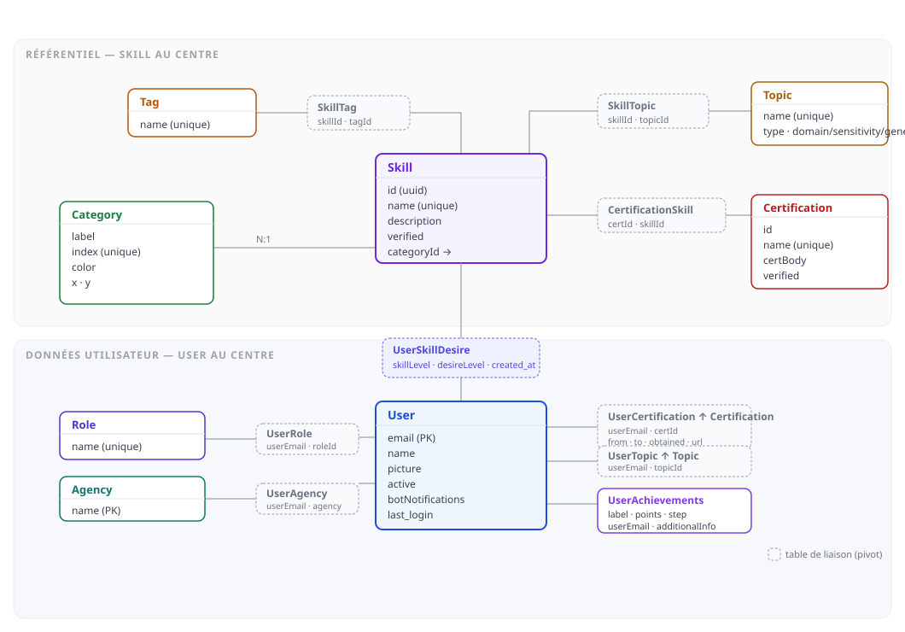
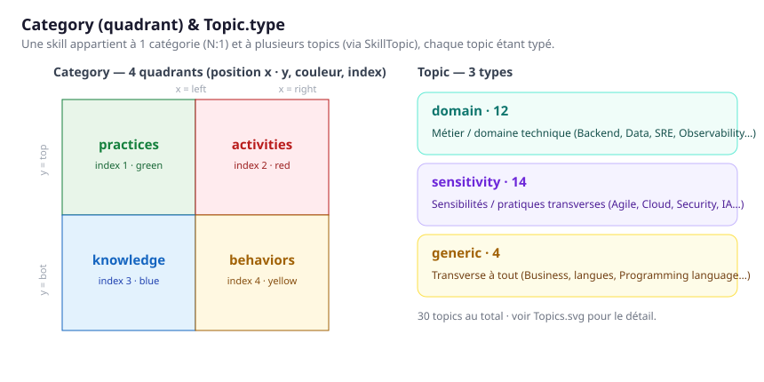
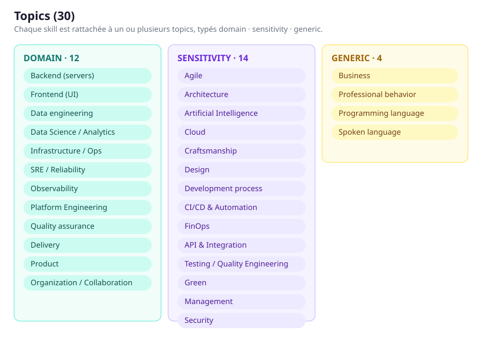
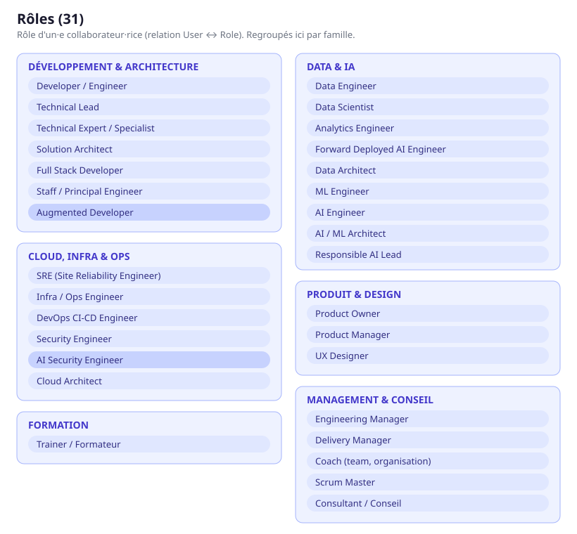
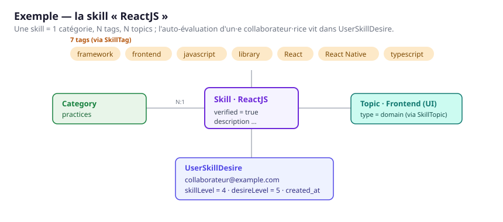

# skillZ — Modèle de données

Documentation de l'**état courant** du modèle de données de skillZ (Hasura / PostgreSQL).
Les référentiels sont versionnés dans `hasura/seeds/` et exportés depuis la base.

## Schéma des tables

Le modèle s'organise autour de deux entités centrales :

- **`Skill`** — le référentiel de compétences. Chaque skill appartient à **une** `Category`
  (N:1) et se rattache à plusieurs `Tag` (via `SkillTag`), `Topic` (via `SkillTopic`) et
  `Certification` (via `CertificationSkill`).
- **`User`** — les collaborateur·rice·s. Un·e user porte des rôles (`UserRole` → `Role`),
  une agence (`UserAgency` → `Agency`), des centres d'intérêt (`UserTopic` → `Topic`),
  des certifications (`UserCertification` → `Certification`) et des succès (`UserAchievements`).
  Son **auto-évaluation** par skill — niveau maîtrisé et niveau désiré, historisée par date —
  vit dans **`UserSkillDesire`**.

Les tables en pointillés sont des **tables de liaison** (pivots).

## Catégories & types de topic

- **`Category`** (4) — positionne la skill dans un quadrant via `x` (left/right) et `y` (top/bot) :
  `practices`, `activities`, `knowledge`, `behaviors`.
- **`Topic.type`** (3) — `domain` (métier / domaine technique), `sensitivity` (sensibilités et
  pratiques transverses), `generic` (transverse à tout).

## Topics

## Rôles

Le rôle d'un·e collaborateur·rice (relation `User` ↔ `Role`), regroupé par famille.

**Développement & Architecture** — Developer / Engineer · Technical Lead · Technical Expert / Specialist · Solution Architect · Full Stack Developer · Staff / Principal Engineer  
**Cloud, Infra & Ops** — SRE (Site Reliability Engineer) · Infra / Ops Engineer · DevOps CI-CD Engineer · Security Engineer · Cloud Architect  
**Data & IA** — Data Engineer · Data Scientist · Analytics Engineer · Forward Deployed AI Engineer · Data Architect · ML Engineer · AI Engineer · AI / ML Architect · Responsible AI Lead  
**Produit & Design** — Product Owner · Product Manager · UX Designer  
**Management & Conseil** — Engineering Manager · Delivery Manager · Coach (team, organisation) · Scrum Master · Consultant / Conseil  
**Formation** — Trainer / Formateur  

## Certifications (189, 59 organismes)

Regroupées par organisme émetteur (`certBody`), triées par nombre décroissant.

- **Google Cloud** (16) — Associate Cloud Engineer · Associate Data Practitioner · Authorized Trainer · BigQuery Qualified Developer · Cloud Digital Leader · Generative AI Leader · Google Cloud Sales Credentials · Professional Agentic Architect · Professional Cloud Architect · Professional Cloud Database Engineer · Professional Cloud Developer · Professional Cloud Devops Engineer · Professional Cloud Network Engineer · Professional Cloud Security Engineer · Professional Data Engineer · Professional ML Engineer
- **SAFe** (13) — Certified SAFe 4 Agilist · Certified SAFe 4 Lean Portfolio Manager · Certified SAFe 4 Program Consultant · Certified SAFe 4 Scrum Master · Certified SAFe 5 Agilist · Certified SAFe 5 Lean Portfolio Manager · Certified SAFe 5 Program Consultant · Certified SAFe 5 Scrum Master · Certified SAFe 6 Agilist · Certified SAFe 6 Architect · Certified SAFe 6 Lean Portfolio Manager · Certified SAFe 6 Product Owner / Manager · Certified SAFe 6 Scrum Master
- **Microsoft** (11) — Microsoft AZ-900: Azure Fundamentals · Microsoft Certified Solutions Associate: Cloud · Microsoft Certified: Azure AI Engineer Associate (AI-102) · Microsoft Certified: Azure AI Fundamentals (AI-900) · Microsoft Certified: Azure Administrator Associate · Microsoft Certified: Azure Data Engineer Associate (DP-203) · Microsoft Certified: Azure Data Scientist Associate · Microsoft Certified: Azure DevOps Engineer Expert (AZ-400) · Microsoft Certified: Azure Developer Associate (AZ-204) · Microsoft Certified: Azure Solutions Architect Expert (AZ-305) · Microsoft Certified: Fabric Data Engineer Associate (DP-700)
- **GitLab** (10) — GitLab Certified Agile Portfolio Management Associate · GitLab Certified Associate · GitLab Certified CI/CD Associate · GitLab Certified CI/CD Specialist · GitLab Certified Duo Agent Platform Associate · GitLab Certified Implementation Services · GitLab Certified Migration Services Certification · GitLab Certified Security Associate · GitLab Fundamentals Associate · GitLab Solution Architect Core Verified Associate
- **Red Hat** (10) — Red Hat Certified Architect (RHCA) · Red Hat Certified Engineer (RHCE) · Red Hat Certified Instructor (RHCI) · Red Hat Certified OpenShift Administrator DO180 · Red Hat Certified OpenShift Administrator DO280 · Red Hat Certified Specialist in Building Resilient Microservices EX328 · Red Hat Certified Specialist in Containers EX188 · Red Hat Certified Specialist in Developing Automation with AAP · Red Hat Certified Specialist in Managing Automation with AAP EX467 · Red Hat Certified System Administrator (RHCSA)
- **AWS** (9) — AWS Certified Big Data - Specialty · AWS Certified Cloud Practitioner · AWS Certified DevOps Engineer - Professional · AWS Certified Developer - Associate · AWS Certified Machine Learning - Specialty · AWS Certified Security - Specialty · AWS Certified Solutions Architect - Associate · AWS Certified Solutions Architect - Professional · AWS Certified SysOps Administrator - Associate
- **The Open Group** (8) — ArchiMate 3 Foundation · ArchiMate 3 Practitioner · Open Agile Architecture Foundation · TOGAF 9 Certified · TOGAF 9 Foundation · TOGAF Enterprise Architecture Foundation · TOGAF Enterprise Architecture Practitioner · The Open Group Certified Architect (Open CA)
- **scrum.org** (7) — Professional Scrum Developer 1 · Professional Scrum Master 1 · Professional Scrum Master 2 · Professional Scrum Master 3 · Professional Scrum Product Owner 1 · Professional Scrum Product Owner 2 · Professional Scrum Product Owner 3
- **Databricks** (6) — Databricks Certified Data Analyst Associate · Databricks Certified Data Engineer Associate · Databricks Certified Data Engineer Professional · Databricks Certified Generative AI Engineer Associate · Databricks Certified Machine Learning Associate · Databricks Certified Machine Learning Professional
- **Scrum Alliance** (6) — Advanced Certified Scrum Master · Advanced Certified Scrum Product Owner · Certified Scrum Master · Certified Scrum Product Owner · Certified Scrum Professional Product Owner · Certified Scrum Professional Scrum Master
- **CNCF** (5) — Certified Kubernetes Administrator · Certified Kubernetes Application Developer · Certified Kubernetes Security Specialist · Kubernetes Cloud Native Associate · Kubernetes Cloud Native Security Associate
- **Snowflake** (5) — SnowPro Advanced: Architect · SnowPro Advanced: Data Analyst · SnowPro Advanced: Data Engineer · SnowPro Advanced: Data Scientist · SnowPro Core Certification
- **Lingueo** (4) — LILATE English B1 · LILATE English B2 · LILATE English C1 · LILATE English C2
- **Oracle** (4) — Java Foundation Certified Junior Associate · Oracle Certified Associate Java SE 8 Programmer · Oracle Certified Professional Java SE 11 Developer · Oracle Certified Professional Java SE 21 Developer
- **Amazon Web Services** (3) — AWS Certified AI Practitioner · AWS Certified Data Engineer - Associate · AWS Certified Machine Learning Engineer - Associate
- **Axelos** (3) — ITIL 3 Foundation · ITIL 4 Foundation · Prince2 Foundation
- **DAMA International** (3) — CDMP Associate · CDMP Master · CDMP Practitioner
- **Elastic** (3) — Elastic Certified Analyst · Elastic Certified Engineer · Elastic Certified Observability Engineer
- **Hashicorp** (3) — HashiCorp Certified: Consul Associate · HashiCorp Certified: Vault Associate · HashiCorp Certified: Vault Operations Professional
- **OVHcloud** (3) — OVHcloud Certified Sales / Presales - Discover · OVHcloud Certified Solution Architect - Discover · OVHcloud Certified Support / Technical Account Manager - Discover
- **SaaS Design** (3) — Master Figma Course: From Beginner to Figma Pro · The Complete Design System Course for Figma (Advanced) · The Complete Figma Design System Course (Advanced)
- **Spring** (3) — Spring Core Developer 4.3 · Spring Core Developer 5 · Spring Professional Certification
- **Astronomer** (2) — Astronomer Certification for Apache Airflow Fundamentals · Astronomer Certification in Apache Airflow DAG Authoring
- **Certificates.dev** (2) — Certified Senior Vue.js Developer · Certified Vue.js Developer
- **certificates.dev** (2) — Mid-Level Vue.js Developer · Senior Vue.js Developer
- **Clever Cloud** (2) — Clever Cloud Certified - Advanced Deployments · Clever Cloud Certified - Cloud Concepts 101
- **CloudBees** (2) — Certified CloudBees Jenkins Engineer · Certified CloudBees Jenkins Platform Engineer
- **Confluent** (2) — Confluent Certified Administrator for Apache Kafka · Confluent Certified Developer for Apache Kafka
- **DataStax** (2) — Apache Cassandra 3.x Administrator Associate Certification · Apache Cassandra 3.x Developer Associate Certification
- **dbt Labs** (2) — dbt Certified Architect · dbt Certified Developer
- **GreenIT.fr** (2) — Eco-conception de services numériques · Green-IT - Etat de l'art
- **Kanban University** (2) — Kanban Management Professional (KMP) · Kanban System Design (KSD)
- **Mirantis** (2) — Docker Certified Associate · Docker Fundamentals
- **MongoDB** (2) — MongoDB Certified DBA · MongoDB Certified Developer
- **OpenJS** (2) — Node.js Application Developer · Node.js Services Developer
- **Zenika** (2) — Eco-conception de services numériques - formation accélérée · EcoZ - 1/2 journée de sensibilisation
- **AJ&Smart** (1) — Design Sprint
- **APMG International** (1) — Lean Green Belt
- **Cloudera** (1) — CCA Spark and Hadoop Developer
- **CréAgile** (1) — Certification "facilitation collaborative avec les Innovation Games" - RS5580
- **Data Vault Alliance** (1) — Data Vault 2.0 Certified Practitioner
- **DevOps Foundation** (1) — DevOps Foundation Certification
- **Google** (1) — Google UX Design Professional Certificate
- **HashiCorp** (1) — HashiCorp Certified: Terraform Associate
- **INR** (1) — Certificat de connaissance Numérique Responsable
- **Kagilum** (1) — Professionnel Scrum Certifié - RS2396
- **Kong** (1) — Kong Gateway Certified Associate
- **Linux Foundation** (1) — Green Software for Practitioners (LFC131)
- **Management 3.0** (1) — Management 3.0
- **NVIDIA** (1) — NVIDIA-Certified Associate: Generative AI and LLMs (NCA-GENL)
- **Offensive Security** (1) — Offensive Security Certified Professional
- **Opquast** (1) — Maîtrise de la qualité en projet Web
- **Project Management Institute** (1) — PMI Agile Certified Practitioner
- **R2Devops** (1) — R2Devops Certified Partner Consultant
- **Rancher** (1) — Certified Rancher Operator: Level One
- **Scaleway** (1) — Scaleway Professional Solution Architect
- **TensorFlow** (1) — TensorFlow Developer
- **The Linux Foundation** (1) — FinOps Certified Practitioner
- **VMware** (1) — Spring Certified Professional

## Exemple

## Exemples de données

Quelques lignes réelles par table (référentiel).

### Agency
`Bordeaux` · `Brest` · `Casablanca` · `Clermont-Ferrand` · `Grenoble` · `La Réunion` · `Lille` · `Lyon` · `Montreal` · `Nantes`

### Category
| label | x | y | color | index |
|---|---|---|---|---|
| activities | right | top | red | 2 |
| behaviors | right | bot | yellow | 4 |
| knowledge | left | bot | blue | 3 |
| practices | left | top | green | 1 |

### Tag
`3D` · `agile` · `ai` · `AI/ML` · `analytics` · `Android` · `angular` · `ansible` · `api` · `appliance`

### Topic
| type | name |
|---|---|
| sensitivity | Agile |
| domain | Analytics Engineering |
| sensitivity | API & Integration |
| sensitivity | Architecture |
| sensitivity | Artificial Intelligence |
| domain | Backend (servers) |
| generic | Business |
| sensitivity | CI/CD & Automation |
| sensitivity | Cloud |
| sensitivity | Craftsmanship |

### Skill
| name | category | verified |
|---|---|---|
| 3D Rendering | knowledge | true |
| ABAC | knowledge | true |
| Accelerate | knowledge | true |
| Acceptance Test Driven Development | practices | true |
| Accessibility | practices | true |
| Access lifecycle policy | activities | true |
| Access logging policy | activities | true |
| Account Management | activities | true |
| Achiever | behaviors | true |
| Activator | behaviors | true |

### SkillTag (skill → tags)
| skill | tags |
|---|---|
| 3D Rendering | 3D, ux |
| Accelerate | devops, transformation |
| Accessibility | angular |
| Access lifecycle policy | governance, modeling, organization, security |
| Access logging policy | auditing, governance, organization, security |
| Achiever | behavior, execution, strength |
| Activator | behavior, influence, strength |
| ActiveMQ | backend, data, java, middleware |
| Adaptable | behavior |
| Adobe Experience Manager (AEM) | tooling, ux |

### SkillTopic (skill → topics)
| skill | topics |
|---|---|
| 3D Rendering | Design |
| Accelerate | Agile, CI/CD & Automation, Craftsmanship, Delivery, Development process |
| Acceptance Test Driven Development | Development process, Testing / Quality Engineering |
| Accessibility | Design |
| Access lifecycle policy | Security |
| Access logging policy | Security |
| Account Management | Business, Management |
| Achiever | Professional behavior |
| Activator | Professional behavior |
| ActiveMQ |  |

### Certification
| name | certBody |
|---|---|
| Advanced Certified Scrum Master | Scrum Alliance |
| Advanced Certified Scrum Product Owner | Scrum Alliance |
| Apache Cassandra 3.x Administrator Associate Certification | DataStax |
| Apache Cassandra 3.x Developer Associate Certification | DataStax |
| ArchiMate 3 Foundation | The Open Group |
| ArchiMate 3 Practitioner | The Open Group |
| Associate Cloud Engineer | Google Cloud |
| Associate Data Practitioner | Google Cloud |
| Astronomer Certification for Apache Airflow Fundamentals | Astronomer |
| Astronomer Certification in Apache Airflow DAG Authoring | Astronomer |

### CertificationSkill (certification → skills)
| certification | skills |
|---|---|
| Advanced Certified Scrum Master | Agile, Scrum, Scrum Master |
| Advanced Certified Scrum Product Owner | Agile, Product Owner, Scrum |
| Apache Cassandra 3.x Administrator Associate Certification | Cassandra, NoSQL Databases |
| Apache Cassandra 3.x Developer Associate Certification | Cassandra, NoSQL Databases |
| ArchiMate 3 Practitioner |  |
| Associate Cloud Engineer | Cloud, GCP |
| Associate Data Practitioner | BigQuery, PySpark, SQL |
| Astronomer Certification for Apache Airflow Fundamentals | Airflow |
| Astronomer Certification in Apache Airflow DAG Authoring | Airflow |
| Authorized Trainer | Cloud, GCP, Training |

### Role
Voir la section **Rôles** ci-dessus (29 rôles).

## Illustration par domaine

Le même modèle sert des domaines très différents — **mêmes tables, contenus différents**.
Deux exemples : **Data** et **Platform / Ops**.

### Domaine Data

- **Rôles clé** — `Data Engineer` (pipelines batch/streaming, ingestion, stockage scalable) ·
  `Analytics Engineer` (couche sémantique, modélisation DWH, dbt) ·
  `Data Architect` (gouvernance, urbanisation multi-cloud, Data Mesh).
- **Technos (skills)** — `Snowflake` · `Databricks` · `dbt` · `Apache Spark / PySpark` ·
  `Apache Kafka` · `Airflow` · `Delta Lake` · `BigQuery` · `Great Expectations` · `Unity Catalog`
- **Certifications** — Databricks (Data Engineer, ML, GenAI) · Snowflake SnowPro (Core, Advanced) ·
  dbt (Developer, Architect) · Google Cloud (Professional Data Engineer, Associate Data Practitioner) ·
  AWS / Azure Data Engineer · Astronomer Airflow · DAMA CDMP · Data Vault 2.0.
- **Regroupement en topics** —
  - `Analytics Engineering` : dbt · dbt Semantic Layer · MetricFlow · Cube · dbt Mesh · Jinja ·
    Dimensional modeling (Kimball) · SCD · Enterprise Data Warehouse · Text-to-SQL
  - `Data engineering` *(extrait)* : PySpark · Apache Kafka · Apache Flink · Apache Iceberg ·
    Delta Lake · Debezium · CDC · Airflow · Great Expectations · Medallion architecture · Lakehouse

### Domaine Platform / Ops

- **Rôles clé** — `SRE (Site Reliability Engineer)` (fiabilité, SLO, incidents) ·
  `Infra / Ops Engineer` (IaC, réseau, systèmes) ·
  `DevOps CI-CD Engineer` (pipelines, livraison continue, GitOps).
- **Technos (skills)** — `Kubernetes` · `Docker` · `Terraform` · `Ansible` · `ArgoCD` ·
  `Helm` · `Prometheus` · `Grafana` · `Jenkins` · `Vault`
- **Certifications** — CNCF Kubernetes (CKA, CKAD, CKS) · HashiCorp (Terraform, Vault, Consul) ·
  Red Hat OpenShift (DO180 / DO280) & Ansible Automation · GitLab CI/CD · CloudBees Jenkins ·
  Docker (Mirantis) · Rancher · Elastic Observability ·
  Cloud (GCP DevOps / Cloud Architect, AWS DevOps / SysOps, Azure AZ-400 / AZ-305).
- **Regroupement en topics** —
  - `CI/CD & Automation` : ArgoCD · FluxCD · Jenkins · GitOps · Helm · Kustomize ·
    Continuous Integration · Continuous Deployment · DevSecOps · CircleCI · Ansible Molecule
  - `Observability` : Prometheus · Grafana · Thanos · Datadog · Dynatrace · Elastic Observability ·
    Fluent Bit · Metrology · Monitoring

## Volumétrie du référentiel

| Table | Nombre |
| --- | ---: |
| Agency | 16 |
| Category | 4 |
| Tag | 171 |
| Topic | 31 |
| Skill | 875 |
| SkillTag | 765 |
| SkillTopic | 824 |
| Certification | 189 |
| CertificationSkill | 180 |
| Role | 29 |
